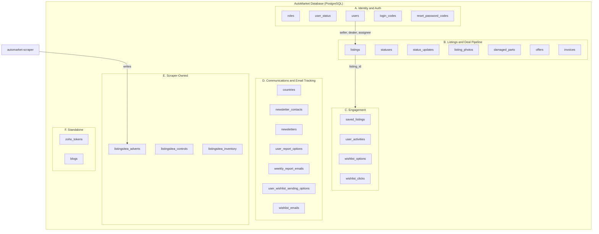
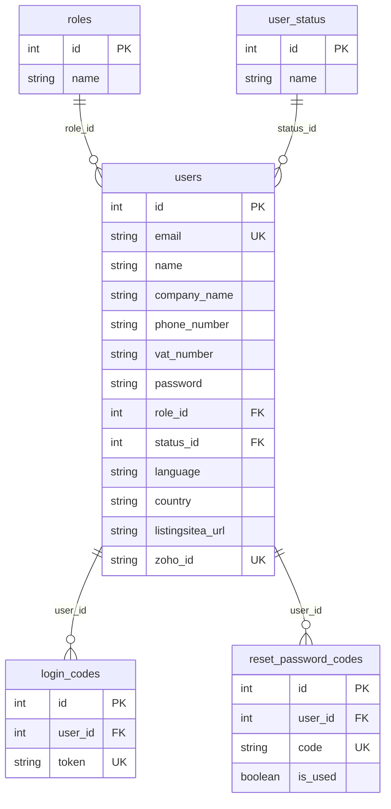
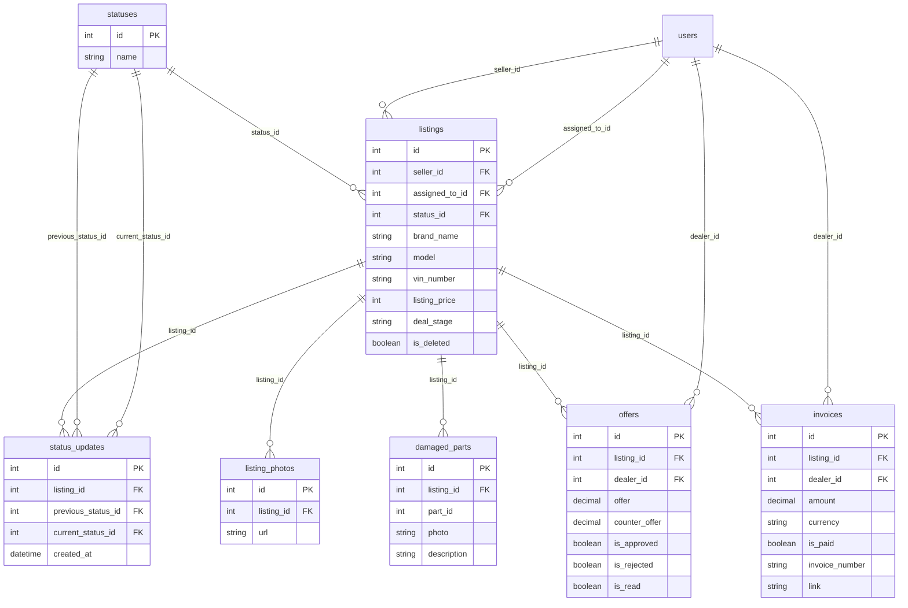
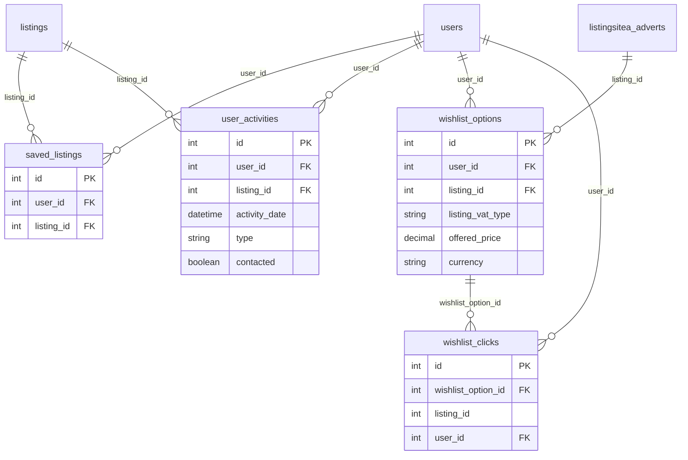
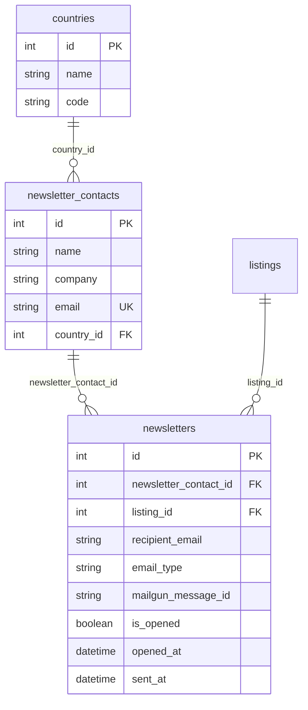
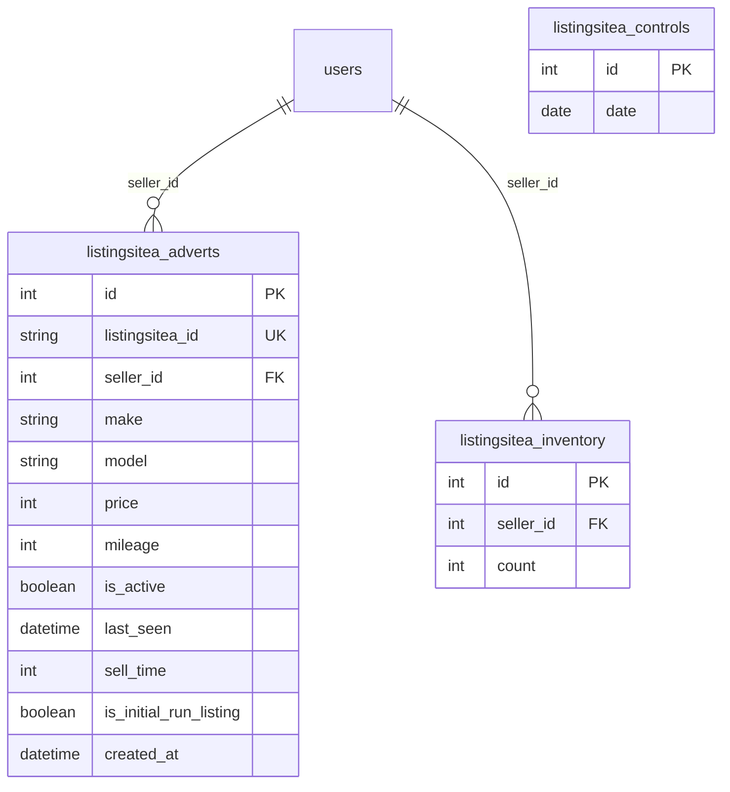
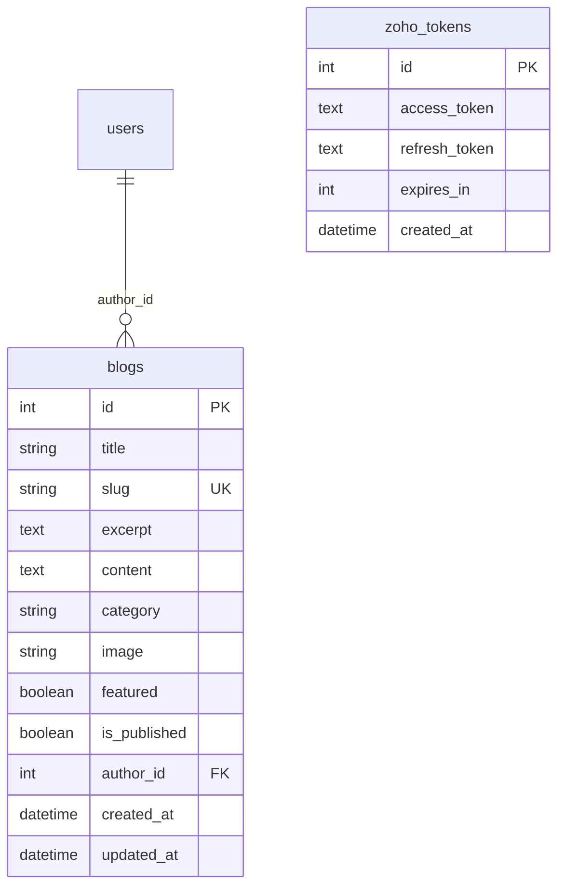

# AutoMarket Database Schema

A complete map of the PostgreSQL database powering the AutoMarket platform.

The database is **shared** between two services:

- **`automarket-backend`** — owns the schema; full CRUD via Sequelize.
- **`automarket-scraper`** — writes directly to `listingsitea_adverts`, `listingsitea_controls`, and `listingsitea_inventory`; reads `users` to learn which dealers to monitor.

**Canonical schema (single source of truth):**

- [`automarket-backend/src/sql/create_tables.sql`](automarket-backend/src/sql/create_tables.sql) — all tables, FKs, indexes
- [`automarket-backend/src/sql/create_countries.sql`](automarket-backend/src/sql/create_countries.sql) — country seed data (run after `create_tables.sql`)
- [`automarket-backend/src/models/associations.js`](automarket-backend/src/models/associations.js) — Sequelize relationship map

> **Foreign keys:** major relationships are enforced in SQL via `FOREIGN KEY` constraints in `create_tables.sql`. A small number of columns (e.g. `wishlist_clicks.listing_id`) remain application-level only. The FK matrix marks any exceptions.

---

## Table of contents

1. [Cluster overview](#1-cluster-overview)
2. [Cluster A — Identity & auth](#2-cluster-a--identity--auth)
3. [Cluster B — Listings & deal pipeline](#3-cluster-b--listings--deal-pipeline)
4. [Cluster C — Engagement (saved, activity, wishlist)](#4-cluster-c--engagement-saved-activity-wishlist)
5. [Cluster D — Communications & email tracking](#5-cluster-d--communications--email-tracking)
6. [Cluster E — Scraper-owned tables](#6-cluster-e--scraper-owned-tables)
7. [Cluster F — Standalone](#7-cluster-f--standalone)
8. [All 27 tables — quick reference](#8-all-27-tables--quick-reference)
9. [Foreign-key matrix](#9-foreign-key-matrix)

---

## 1. Cluster overview



| Cluster | Tables | Purpose |
|---------|--------|---------|
| A. Identity & auth | 5 | Users, roles, auth tokens |
| B. Listings & deal pipeline | 7 | Cars and the 14-stage workflow |
| C. Engagement | 4 | Saved, activity, wishlist |
| D. Communications & email tracking | 8 | Newsletter + weekly report + wishlist emails |
| E. Scraper-owned | 3 | Scraped dealer inventory |
| F. Standalone | 2 | Blogs, Zoho tokens |
| **Total** | **28** | |

---

## 2. Cluster A — Identity & auth

`users` is the most-joined-to table in the database. Dealers and admins are both `users`, distinguished by `role_id` (1 = admin, 2 = dealer) and `status_id` (2 = active).



`login_codes` are used by magic-link emails (wishlist, weekly report). `reset_password_codes` are used by `/forgot-password` and `/reset-password`.

---

## 3. Cluster B — Listings & deal pipeline

The core of the platform. A `listings` row carries the car spec + every field needed to drive the 14-stage workflow (seller info, buyer info, transport, payment dates, tracking codes). The status of each listing is one of 14 rows in `statuses`, and every change is logged into `status_updates`.



`statuses` has 14 fixed rows (1=Cars for Sale … 13=Deal Done, 14=No Deal). The `listings` table also carries workflow and billing fields (transport, payment dates, tracking codes, proforma invoice details).

---

## 4. Cluster C — Engagement (saved, activity, wishlist)

How a dealer interacts with both real listings and scraped adverts.



`saved_listings` powers the "Saved Cars" page. `user_activities.type` is one of: web click, mail open, newsletter, wishlist opened. `wishlist_options` are created by admin in `/wishlist-options`. `wishlist_clicks` are recorded when a dealer clicks "I'm Interested" on the dashboard `/wishlist` page.

> `wishlist_options.listing_id` has an SQL FK to `listingsitea_adverts.id` (historical column name).

---

## 5. Cluster D — Communications & email tracking

Every outbound email is logged with its Mailgun message id so the inbound webhook (`POST /api/mailgun`) can record opens and clicks. Three independent email pipelines live here.

### Newsletter pipeline



### Weekly dealer report pipeline

```mermaid
erDiagram
  users ||--|| user_report_options : user_id
  users ||--o{ weekly_report_emails : user_id

  user_report_options {
    int id PK
    int user_id FK_UK
    jsonb when_to_send
    boolean is_sending
    int percentage
    jsonb suggestions
  }
  weekly_report_emails {
    int id PK
    int user_id FK
    string recipient_email
    string mailgun_message_id UK
    date week_start_date
    date week_end_date
    int week_number
    int year
    string language
    boolean is_opened
    datetime opened_at
  }
```

Hourly cron compares `when_to_send` to the current day+hour to dispatch weekly report emails.

### Wishlist email pipeline

```mermaid
erDiagram
  users ||--|| user_wishlist_sending_options : user_id
  users ||--o{ wishlist_emails : user_id

  user_wishlist_sending_options {
    int id PK
    int user_id FK_UK
    jsonb when_to_send
    boolean is_sending
  }
  wishlist_emails {
    int id PK
    int user_id FK
    string mailgun_message_id UK
    boolean is_opened
    datetime when_opened
    datetime sent_at
  }
```

---

## 6. Cluster E — Scraper-owned tables

These three tables are written by the **scraper service**, not by the backend API. They power the admin's "Scraped Dealers" / "Scraping Analysis" pages and feed the wishlist matching pipeline.



`listingsitea_controls` records one row per scrape session for week-over-week deltas. `listingsitea_inventory` is a weekly snapshot of advert count per dealer.

---

## 7. Cluster F — Standalone



`zoho_tokens` caches OAuth tokens for optional Zoho CRM sync. `blogs` has a trigger that auto-bumps `updated_at` on UPDATE.

---

## 8. All 28 tables — quick reference

| # | Table | Cluster | Primary keys / unique | Key columns |
|---|-------|---------|----------------------|-------------|
| 1 | `roles` | A | `id` PK | `name` |
| 2 | `user_status` | A | `id` PK | `name` |
| 3 | `users` | A | `id` PK; `email` unique; `zoho_id` unique | `role_id`, `status_id`, `company_name`, `vat_number`, `language`, `country`, `listingsitea_url` |
| 4 | `login_codes` | A | `id` PK; `token` unique | `user_id` |
| 5 | `reset_password_codes` | A | `id` PK; `code` unique | `user_id`, `is_used` |
| 6 | `statuses` | B | `id` PK | `name` (14 fixed rows) |
| 7 | `listings` | B | `id` PK | `seller_id`, `status_id`, `assigned_to_id`, `brand_name`, `model`, `vin_number`, `km_stand`, `listing_price`, `vat_or_margin`, `deal_stage`, `is_deleted`, `expiration`, `reference_no` |
| 8 | `status_updates` | B | `id` PK; FKs to `listings`, `statuses` | `listing_id`, `previous_status_id`, `current_status_id` |
| 9 | `listing_photos` | B | `id` PK; FK to `listings` | `listing_id`, `url` |
| 10 | `damaged_parts` | B | `id` PK | `listing_id`, `part_id`, `photo`, `description` |
| 11 | `offers` | B | `id` PK | `dealer_id`, `listing_id`, `offer`, `counter_offer`, `is_approved`, `is_rejected`, `is_read` |
| 12 | `invoices` | B | `id` PK; `invoice_number` unique | `dealer_id`, `listing_id`, `amount`, `currency`, `is_paid`, `due_date`, `link` |
| 13 | `saved_listings` | C | `id` PK; UNIQUE(`user_id`, `listing_id`) | `user_id`, `listing_id` |
| 14 | `user_activities` | C | `id` PK | `user_id`, `listing_id`, `activity_date`, `type`, `contacted` |
| 15 | `wishlist_options` | C | `id` PK; UNIQUE(`user_id`, `listing_id`); FK `listing_id` → `listingsitea_adverts` | `user_id`, `listing_id`, `offered_price`, `offered_price_vat_type`, `currency` |
| 16 | `wishlist_clicks` | C | `id` PK | `wishlist_option_id`, `listing_id`, `user_id` |
| 17 | `countries` | D | `id` PK | `name`, `code` |
| 18 | `newsletter_contacts` | D | `id` PK; `email` unique | `name`, `company`, `country_id` |
| 19 | `newsletters` | D | `id` PK; FKs to `listings`, `newsletter_contacts` | `newsletter_contact_id`, `listing_id`, `email_type`, `recipient_email`, `mailgun_message_id`, `is_opened`, `opened_at`, `sent_at` |
| 20 | `user_report_options` | D | `id` PK; `user_id` unique | `when_to_send` JSONB, `is_sending`, `percentage`, `suggestions` JSONB |
| 21 | `weekly_report_emails` | D | `id` PK; `mailgun_message_id` unique; FK to `users` | `user_id`, `week_start_date`, `week_end_date`, `week_number`, `year`, `language`, `is_opened`, `opened_at` |
| 22 | `user_wishlist_sending_options` | D | `id` PK; `user_id` unique; FK to `users` | `when_to_send` JSONB, `is_sending` |
| 23 | `wishlist_emails` | D | `id` PK; `mailgun_message_id` unique | `user_id`, `is_opened`, `when_opened`, `sent_at` |
| 24 | `listingsitea_adverts` | E | `id` PK; `listingsitea_id` UNIQUE | `listingsitea_id`, `seller_id`, `make`, `model`, `price`, `mileage`, `is_active`, `last_seen`, `sell_time`, `is_initial_run_listing`, `original_image_url` |
| 25 | `listingsitea_controls` | E | `id` PK | `date` |
| 26 | `listingsitea_inventory` | E | `id` PK; FK to `users` | `seller_id`, `count` |
| 27 | `zoho_tokens` | F | `id` PK | `access_token`, `refresh_token`, `expires_in` |
| 28 | `blogs` | F | `id` PK; `slug` unique | `title`, `category`, `featured`, `is_published`, `author_id`, `content` |

> `wishlist_options.listing_id` is a historical column name; the SQL FK points at `listingsitea_adverts.id` (scraped inventory), not `listings.id`.

---

## 9. Foreign-key matrix

Legend: `SQL` = `FOREIGN KEY` in [`create_tables.sql`](automarket-backend/src/sql/create_tables.sql); `ORM` = Sequelize-only (no DB constraint).

| Child table | Column | → Parent table.column | Enforcement |
|-------------|--------|----------------------|-------------|
| `users` | `role_id` | `roles.id` | SQL |
| `users` | `status_id` | `user_status.id` | SQL |
| `login_codes` | `user_id` | `users.id` | SQL |
| `reset_password_codes` | `user_id` | `users.id` | SQL |
| `listings` | `seller_id` | `users.id` | SQL |
| `listings` | `assigned_to_id` | `users.id` | SQL |
| `listings` | `status_id` | `statuses.id` | SQL |
| `status_updates` | `listing_id` | `listings.id` | SQL |
| `status_updates` | `previous_status_id` | `statuses.id` | SQL |
| `status_updates` | `current_status_id` | `statuses.id` | SQL |
| `listing_photos` | `listing_id` | `listings.id` | SQL |
| `damaged_parts` | `listing_id` | `listings.id` | SQL |
| `offers` | `listing_id` | `listings.id` | SQL |
| `offers` | `dealer_id` | `users.id` | SQL |
| `invoices` | `listing_id` | `listings.id` | SQL |
| `invoices` | `dealer_id` | `users.id` | SQL |
| `saved_listings` | `user_id` | `users.id` | SQL |
| `saved_listings` | `listing_id` | `listings.id` | SQL |
| `user_activities` | `user_id` | `users.id` | SQL |
| `user_activities` | `listing_id` | `listings.id` | SQL |
| `wishlist_options` | `user_id` | `users.id` | SQL |
| `wishlist_options` | `listing_id` | `listingsitea_adverts.id` | SQL |
| `wishlist_clicks` | `wishlist_option_id` | `wishlist_options.id` | SQL |
| `wishlist_clicks` | `user_id` | `users.id` | SQL |
| `wishlist_clicks` | `listing_id` | — | ORM (no FK; may be platform listing or scraped advert) |
| `newsletter_contacts` | `country_id` | `countries.id` | SQL |
| `newsletters` | `newsletter_contact_id` | `newsletter_contacts.id` | SQL |
| `newsletters` | `listing_id` | `listings.id` | SQL |
| `user_report_options` | `user_id` | `users.id` | SQL |
| `weekly_report_emails` | `user_id` | `users.id` | SQL |
| `user_wishlist_sending_options` | `user_id` | `users.id` | SQL |
| `wishlist_emails` | `user_id` | `users.id` | SQL |
| `listingsitea_adverts` | `seller_id` | `users.id` | SQL |
| `listingsitea_inventory` | `seller_id` | `users.id` | SQL |
| `blogs` | `author_id` | `users.id` | SQL |
