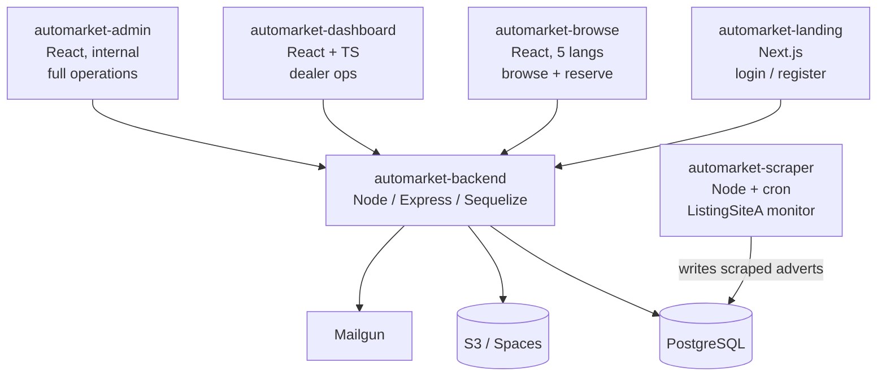
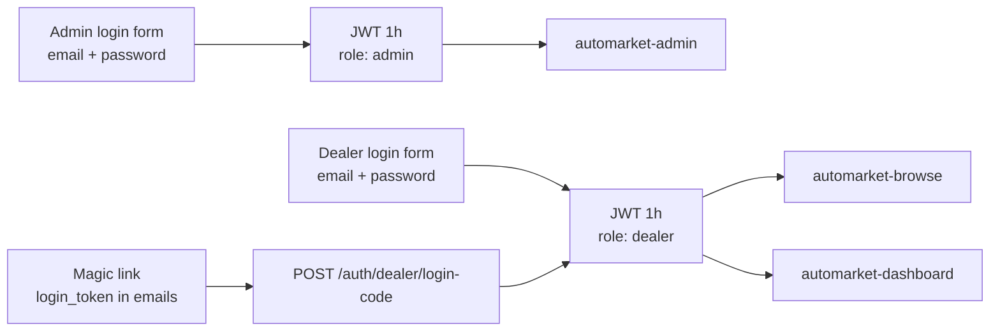

# AutoMarket Platform — Feature Inventory

A complete walkthrough of every capability across the AutoMarket B2B vehicle-trading ecosystem.

This document inventories what the platform **actually does** today — every page, button, workflow, cron job, integration, and email — split by user role and sub-project. It is meant for reviewers, new engineers, and anyone evaluating the system end-to-end.

> Names like `ListingSiteA/B/C` and `automarket.example.com` are sanitized placeholders for the real production targets and domains (see [`README.md`](README.md)).

---

## Table of contents

1. [Platform overview](#1-platform-overview)
2. [Admin panel — `automarket-admin`](#2-admin-panel--automarket-admin)
3. [Dealer dashboard — `automarket-dashboard`](#3-dealer-dashboard--automarket-dashboard)
4. [Buyer browse app — `automarket-browse`](#4-buyer-browse-app--automarket-browse)
5. [Landing / marketing site — `automarket-landing`](#5-landing--marketing-site--automarket-landing)
6. [Backend API — `automarket-backend`](#6-backend-api--automarket-backend)
7. [Scraper & checker — `automarket-scraper`](#7-scraper--checker--automarket-scraper)
8. [Cross-app authentication model](#8-cross-app-authentication-model)
9. [TL;DR by role](#9-tldr-by-role)

---

## 1. Platform overview

The platform is composed of six sub-projects sharing one PostgreSQL database and one Express API.

| Sub-project | Stack | Audience | Purpose |
|-------------|-------|----------|---------|
| [`automarket-admin`](automarket-admin/) | React 19, Vite, Tailwind | Internal staff | Full operations console |
| [`automarket-dashboard`](automarket-dashboard/) | React 18 + TS, Vite | Logged-in dealers | Self-service operations |
| [`automarket-browse`](automarket-browse/) | React 18, Vite, i18n (5 langs) | Logged-in dealers | Vehicle browse + reserve/offer |
| [`automarket-landing`](automarket-landing/) | Next.js 15 | Public | Marketing + auth entry point |
| [`automarket-backend`](automarket-backend/) | Node, Express, Sequelize | All clients | REST API, email, cron, files |
| [`automarket-scraper`](automarket-scraper/) | Node, Puppeteer/Cheerio, cron | Internal | Dealer-inventory scraping |

---

## 2. Admin panel — `automarket-admin`

The internal console. One role: any authenticated admin sees everything. Auth via `POST /auth/admin/login`, 24‑hour session in `localStorage`.

### 2.1 Sales pipeline — Kanban + 14 status views

The full B2B deal lifecycle is modelled as 14 statuses, navigable from the sidebar with live counts and red "not viewed" badges.

- **Kanban board (`/`)** — drag-and-drop cards across columns; allowed transitions are enforced by `STATUS_TRANSITIONS` and trigger workflow APIs (reserve, offer, purchase, invoice, payment, transport, etc.).
- **One page per status (`/status/1` … `/status/14`)** — per-row actions: move-to-next-status, reactivate (from "No Deal"), edit. Client-side filter and sort by registration, VIN, ref, brand, model, year, color, KM, fuel, transmission, price.
- **14 deal stages**: Cars for Sale → Reserved → Offers → Purchased → Proforma Invoice Sent → Payment Received → Payment Sent → Transport Booked → Documents Sent → Car Picked Up → Car Delivered → Car De-registered → Deal Done; with **No Deal** as a parallel terminal status.
- **Popup-gated transitions** collect stage-specific data: pick dealer, offer amount, transport cost, billing company, seller info, pickup/delivery dates, tracking codes.

### 2.2 Listings (cars) CRUD

- **Add Deal (`/add-deal`)** — paste any URL from these 6 sources to auto-extract a listing:
  - ListingSiteA, ListingSiteB, ListingSiteC
  - Hasznaltauto.hu, Sauto.cz, Mobile.de
- Full vehicle form: specs, seller, Belgium price, transport cost, features, **damaged-parts editor** (25 body parts with photo + description), manual + scraped image uploads.
- Expiration window: 48 / 72 / 120 hours.
- **Listing Detail (`/listing/:id`)** — edit all fields, change status, delete listing, delete individual photos, manage damaged parts.

### 2.3 Offers (`/offers`)

- View **active offers** (paginated) and **declined offers**.
- Per offer: **Accept**, **Counter Offer** (with amount), **Reject**.
- **Make Offer (`/make-offer`)** — hidden from sidebar; lets an admin create an offer on behalf of a dealer.

### 2.4 Dealer (user) management

- **Dealers (`/dealers`)** — paginated list, client-side search, inline **change status** dropdown, sortable columns.
- **Add Dealer (`/add-dealer`)** — full record (name, company, VAT, password, language, country).
- **Dealer Detail (`/dealers/:id`)** — edit all fields incl. billing address + ListingSiteA URL.
- **Add Scraped Dealer (`/add-scraped-dealer`)** — minimal record (name, email, ListingSiteA URL) for dealers tracked only via the scraper.

### 2.5 Email / newsletter (`/email-contacts`)

- **Add newsletter contact** (name, company, email, country).
- **Send newsletter by country** — multi-select countries + optional specific listings → bulk Mailgun send.
- **Delete newsletter contact**.

### 2.6 Activity analytics (`/activity`)

Read-only feed of dealer interactions, grouped by listing → user → events. Four tabs:

- Web Activities (browse clicks)
- Mail Activities (newsletter / weekly-report opens, via Mailgun webhooks)
- Newsletter Clicks
- Wishlist Opened

Filters: text search by user, user dropdown, listing dropdown, registration number.

### 2.7 Blog CMS (`/blogs`)

- Paginated list + search.
- Create (with image upload), edit, delete.
- Auto-publish, auto-feature, auto-date on create.

### 2.8 Scraped-dealer reporting (`/scraped-dealers`)

- **Weekly dealer-sales performance** dashboard: per-dealer cars sold, avg selling price, avg days to sell, week-over-week inventory delta.
- Top fastest-selling cars table with image modal.
- **See Solds (`/dealer-solds/:dealerId`)** — sold-car history with filter by 1 / 2 / 4 / 8 / 12 weeks.
- **Edit / Generate Report popup** — pick sold listings, assign reference codes, choose day + hour to send, toggle "send now vs schedule"; honored by the weekly cron.

### 2.9 Scraping analysis (`/scraping-analysis`)

- **Overview mode**: dealer table filterable by sold-12d, sold-2d, scraped-2d, active adverts.
- **Detailed mode**: today's sales summary + per-dealer expandable cards with car details and demand badges.
- From here, admins can also batch-add scraped cars to a dealer's wishlist queue and post it.

### 2.10 Wishlist tooling

- **Wishlist Options (`/wishlist-options`)** — for any dealer, pick from their scraped inventory and queue items with offered price / VAT / currency, then **batch-post** to the dealer's wishlist.
- **Wishlist Sending Options popup** — per-dealer schedule (day-of-week + time + on/off) for automated wishlist email digests (cron-driven).
- **Wishlist Orders (`/wishlist-orders`)** — read-only view of click-throughs from wishlist emails.

### 2.11 Login URL generator (`/login-urls`)

- Pulls all dealers' login tokens and generates copy-to-clipboard magic links into the dealer dashboard:
  - `dashboard.../wishlist?login_token=...`
  - `dashboard.../fastest?login_token=...`
- Used to email dealers passwordless deep links.

### 2.12 Admin: routes summary

| Route | Page |
|-------|------|
| `/login` | Login |
| `/` | Kanban dashboard |
| `/status/:id` | Per-status pipeline (1–14) |
| `/add-deal` | Create listing (with URL scraping) |
| `/listing/:id` | Listing detail (edit/delete) |
| `/offers` | Active + declined offers |
| `/make-offer` | Create offer on behalf of dealer (hidden) |
| `/dealers`, `/add-dealer`, `/dealers/:id` | Dealer CRUD |
| `/email-contacts` | Newsletter contacts + bulk send |
| `/activity` | Activity analytics |
| `/blogs` | Blog CMS |
| `/scraped-dealers`, `/add-scraped-dealer`, `/dealer-solds/:id` | Scraped-dealer reporting |
| `/scraping-analysis` | Scraping analytics |
| `/wishlist-options`, `/wishlist-orders` | Wishlist tooling |
| `/login-urls` | Magic-link generator |

### 2.13 Known gaps in the admin UI

- No exports (CSV / PDF / Excel) anywhere.
- No role / permission system — every admin sees everything.
- A few routes are hidden (`/make-offer`, `/test`) or imported but unrouted (`Inventory`, `Sales`, `CarsForSale`, `Reserved`).
- "Print Details" on listing detail and a few "Browse Cars" buttons are not wired.
- Security: `verifyAdmin` middleware exists but is not currently applied to admin routes — most admin-facing endpoints are reachable without an admin JWT in the present code.

---

## 3. Dealer dashboard — `automarket-dashboard`

React 18 + TS. Auth is delivered via JWT in URL (`?token=` or `?login_token=`); the dashboard does not host a login form (handled by landing). All 11 sidebar items are visible to every dealer.

| Page | What the dealer can do |
|------|------------------------|
| **Overview (`/`)** | 4 stat cards (Purchased, Reserved, Offers, Unpaid Invoices) + recent listings preview + reserved/offers/purchased previews with 10-step deal progress. Cards navigate to their section. |
| **Reserved Cars (`/reserved-cars`)** | Full list with reservation metadata; modal with specs, features, dealer contact, photo gallery. Read-only. |
| **Purchased Cars (`/purchased`)** | Payment pipeline with status (Pending / Overdue / Completed). "Complete Payment" is currently a UI simulation. |
| **Car Tracker Status (`/tracker`)** | 10-step progress per car (Purchased → Deal Done), invoice modal, registration-doc UPS tracking modal with "Track on UPS Express" link + copy-code button. |
| **My Offers (`/offers`)** | View all offers with status; **accept** or **decline counter-offers** (writes back to API). |
| **Invoices (`/invoices`)** | List + tabs (All / Pending / Overdue / Paid). Pay Now / Download are currently stubs. |
| **Saved Cars (`/saved`)** | Grid/list toggle, client-side search, **unsave** via API; details open the browse app. |
| **Your Fastest Selling Cars (`/fastest`)** | Weekly report rendered from server. For each fast-selling car the dealer has, AutoMarket suggests a similar offer; "View Our Offer" deep-links to browse. |
| **Wishlist (`/wishlist`)** | Personalized list of cars AutoMarket can source for the dealer; **"I'm Interested"** sends a click event for sales follow-up. Hotjar enabled here. Multi-language. |
| **Profile (`/profile`)** | Edit name/email/company/phone/VAT/website; change password. Notifications and Preferences tabs are UI-only today. |

External links: a **Browse Cars** button in the header opens the browse SPA pre-authenticated with the dealer's token.

---

## 4. Buyer browse app — `automarket-browse`

React 18 + Vite. **Auth-gated** — public visitors are bounced to landing.

- **Listings grid (`/`)** with debounced filtering: brand, model, year, mileage + a detailed popup (reference, price range €0–400k, body type, fuel, transmission, HP, drive type, seats, color). Sort by newest / oldest / price asc/desc. URL query-param friendly.
- **Listing detail (`/listings/:id`)** with tabs:
  - **Overview** (full specs)
  - **Equipment** (features list)
  - **Condition** (damaged-parts diagram)
- Image carousel with fullscreen view, similar-listings carousel, countdown for "remaining hours".
- **Buyer actions**: Save / Unsave, **Reserve** (one click), **Make Offer** (amount popup). Activity is tracked.
- **Newsletter unsubscribe (`/unsubscribe/:contactId`)** — only public page; one-click unsubscribe.
- **5 languages** (en / nl / fr / it / de), persisted server-side per dealer via `POST /users/change-language`.
- Header links into the dashboard SPA (Wishlist, Fastest, Overview, Reserved, Offers, Purchased, Invoices, Tracker, Saved, Profile).

---

## 5. Landing / marketing site — `automarket-landing`

Next.js 15. Most marketing pages are intentionally disabled (`notFound()`); only these are live today:

- **`/`** — minimal hero with Login / Register buttons (the rich features section, customer logos, getting-started and `SiteFooter` are commented out).
- **`/login`** — dealer login with "remember me", validations; on success redirects to dashboard with `?token=`.
- **`/register`** — dealer signup (name, email, company, phone, VAT, password); must accept Terms + Privacy; success shows "account under review" then continues to login.

Coded-but-disabled routes (components exist; ready to re-enable): `/about`, `/contact`, `/blog`, `/blog/[slug]`, `/forgot-password`, `/reset-password`.

There is **no email-verification flow** anywhere on the platform. Language selectors on landing are cosmetic (no real i18n library wired).

---

## 6. Backend API — `automarket-backend`

Node / Express + Sequelize on PostgreSQL. The single source of truth for every UI.

### 6.1 Data model — 27 Sequelize entities

Users (admin = role 1, dealer = role 2), Roles, UserStatus, Countries, Listings, ListingPhotos, DamagedParts, Statuses, StatusUpdates, Offers, Invoices, SavedListings, UserActivity, NewsletterContacts, Newsletters (with Mailgun message id + open tracking), Blogs, LoginCodes (passwordless), ResetPasswordCodes, UserReportOptions (weekly schedule), WeeklyReportEmails (open tracking), WishlistOptions, UserWishlistSendingOptions, WishlistEmails (open tracking), WishlistClicks, Advert (scraped inventory), ListingSiteAInventory (snapshots), ZohoToken.

### 6.2 Mount points

- `/auth` — admin + dealer auth, dealer CRUD, activity, scraped-dealer reports
- `/api/listings` — listings CRUD, on-demand URL extractors, all 14 deal-stage transitions, wishlist batch
- `/api/users` — dealer ops, newsletter, wishlist, weekly report, test-email endpoints
- `/api/dashboard` — dealer-protected dashboard endpoints
- `/api/offers` — offer accept / counter / reject
- `/api/blogs` — blog CMS
- `/api/mailgun` — Mailgun event webhook (opens/clicks/delivery)

### 6.3 Cron jobs

All cron times are `Europe/Stockholm`.

| Job | Schedule | What it does |
|-----|----------|--------------|
| Expire listings | every 30 min | Listings older than their expiration in status 1 or 3 → move to status 14 (No Deal), record a StatusUpdate. |
| Weekly dealer report | hourly | If current day+hour matches a dealer's `UserReportOptions`, mint a login code and send the weekly report email; record `WeeklyReportEmail` for open tracking. |
| Wishlist notifications | hourly | If schedule matches `UserWishlistSendingOptions`, send the personalized wishlist digest; record `WishlistEmail`. |
| Newsletter sending | on-demand | Bulk send via Mailgun with Bottleneck rate limiter; country targeting + optional listing attachments. |
| Chrome cleanup | every 10 min | Kills orphaned Puppeteer processes. |
| Follow-up emails | empty placeholder | Not yet implemented. |
| ListingSiteB URL validation | hourly | Currently disabled in prod (once mistakenly deleted prod listings). |

### 6.4 Email system (Mailgun EU)

- **Multi-language stage emails** (en/nl/fr/it/de) for every step of the deal pipeline: cars-for-sale, reserved, offers, purchased, proforma-invoice-sent, payment-received/sent, transport-booked, documents-sent, car-picked-up/delivered/de-registered, deal-done, no-deal.
- **Transactional**: dealer welcome (pending), welcome-complete (activated), counter-offer, counter-offer-rejected, password reset, landing contact form, newsletter, wishlist notification, weekly dealer report.
- **PDF invoices** via Puppeteer rendering of `src/templates/invoice-template.html`.
- Inbound Mailgun webhook `POST /api/mailgun` records opens/clicks for newsletters, weekly reports, and wishlist emails — feeding the admin Activity dashboard.
- Internal test endpoints `POST /api/users/test-mails` and `/test-specific-email`; separate `email-preview-server.js` for browser preview.

### 6.5 Third-party integrations

- **PostgreSQL** — shared by backend + scraper
- **Mailgun** (EU region) — all email
- **S3-compatible object storage** (DigitalOcean Spaces / MinIO) with Sharp compression — listing images, damaged-part photos, blog images
- **Oxylabs** — Real-Time Scraper API (on-demand URL extraction from admin panel) and Residential Proxy (background scraper)
- **OpenAI GPT-4o-mini** — translates/normalizes listing data, classifies fuel type & power on scraped data, fallback extraction for unknown listing URLs
- **Puppeteer** — page rendering, PDF invoices
- **Zoho CRM** (optional, legacy) — deal-stage sync; tokens stored in DB; system works without it

---

## 7. Scraper & checker — `automarket-scraper`

Standalone Node service writing **directly to the shared Postgres** (not through the API).

- **What it scrapes**: dealer inventories on ListingSiteA — both the **Belgian** site (REST API + Cheerio detail pages) and the **Swiss** site (`api.listingsitea.ch/v1/listings/search`).
- **Schedule**: scraper cron daily at 00:00 UTC, checker cron daily at 02:00 UTC. Also runs once shortly after startup; manually triggerable via `POST /run/scraper` and `POST /run/checker`. Health/status at `GET /health`, `GET /status`.
- **Checker service**: iterates each user's active scraped adverts, re-fetches the listing page through the Oxylabs proxy with 3 retries; if gone, marks rows `is_active=false`, sets `last_seen`, computes `sell_time` (days listed). Powers admin "sold cars" and "fastest selling" insights.
- **Proxy / anti-block**: Oxylabs residential proxy at `pr.oxylabs.io:7777`; configurable concurrency per user / advert; rate-limited sequential processing; optional `ALLOW_INSECURE_TLS` fallback.
- **OpenAI** is used in-scraper to clean fuel-type / horsepower strings.
- **Auxiliary scripts**: `fetchImagesBelgium.js` and `fetchImagesSwiss.js` backfill listing images into S3 / MinIO.

---

## 8. Cross-app authentication model

- **JWT (1h expiry)** signed with `JWT_SECRET`. Payload includes `id`, `role`.
- `verifyDealerToken` middleware (role=dealer, role_id=2, status_id=2) is actively applied to dealer routes.
- `verifyAdmin` middleware exists but is currently not applied to any route — most admin-panel endpoints are reachable without an admin JWT in the current code.
- **Passwordless flows**: 6-digit reset codes (`ResetPasswordCode`) + opaque login codes (`LoginCode`) embedded in email links for weekly report & wishlist sends.

---

## 9. TL;DR by role

### Admin

Manages the entire deal lifecycle (Kanban + per-status pipelines), creates/edits/deletes listings (with on-demand URL scraping from 6 sources), manages dealers (CRUD + status + magic-link generator), processes offers, runs newsletters by country, schedules and previews weekly dealer reports & wishlist digests, batch-builds wishlists from scraped inventory, monitors scraping analytics and per-dealer sales performance, authors blog posts, and inspects per-user activity (clicks, opens, wishlist interest).

### Dealer (logged-in)

Browses listings in 5 languages, reserves cars, makes offers, accepts/rejects counter-offers, manages saved cars, tracks purchases through a 10-step delivery pipeline, views invoices and registration-doc UPS tracking, receives weekly "fastest selling" reports and a curated wishlist with one-click interest signaling, and manages profile + password.

### Public visitor

Sees only the landing hero, can log in or register, and can use the public newsletter unsubscribe page. There is no public car browse, no public contact form (page disabled), no email verification.
