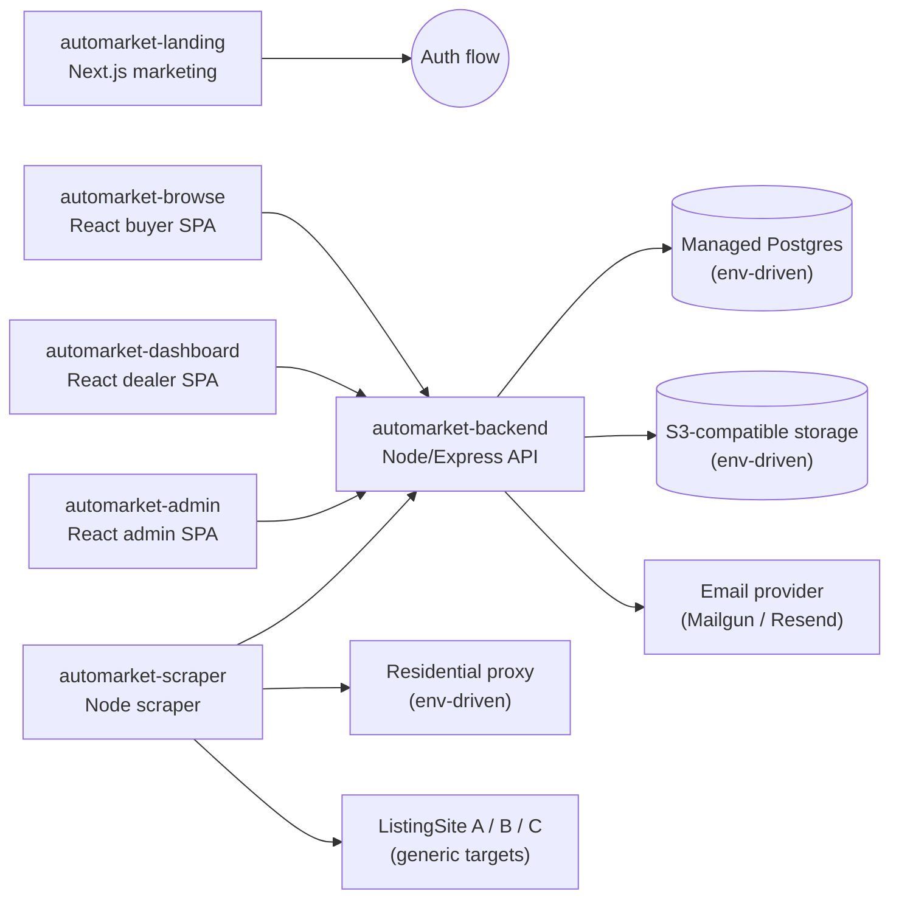

# AutoMarket Platform (Sanitized Portfolio Showcase)

> **SECURITY-SANITIZED:** This repository is a sanitized portfolio copy of a real, deployed B2B automotive trading platform. All customer brand names, infrastructure identifiers, credentials, and business data have been replaced with fictional **AutoMarket** placeholders. The original production credentials have been rotated and are not included here.

## Overview

A full-stack car dealership platform enabling B2B vehicle sourcing, listing management, dealer dashboards, admin tooling, automated scraping, and transactional email workflows.

## Architecture



## Sub-projects

| Directory | Stack | Purpose |
|-----------|-------|---------|
| [`automarket-backend/`](automarket-backend/) | Node.js, Express, Sequelize, PostgreSQL | REST API: auth, listings, invoices, emails, cron jobs |
| [`automarket-scraper/`](automarket-scraper/) | Node.js, Puppeteer/Cheerio, cron | Automated listing scraper with checker service |
| [`automarket-admin/`](automarket-admin/) | React, Vite, Tailwind | Internal admin panel for dealers, deals, scraping |
| [`automarket-browse/`](automarket-browse/) | React, Vite, i18n (5 languages) | Public buyer-facing car browse experience |
| [`automarket-dashboard/`](automarket-dashboard/) | React, TypeScript, Vite | Dealer dashboard: wishlist, purchases, invoices |
| [`automarket-landing/`](automarket-landing/) | Next.js, Tailwind | Marketing site with auth flows |

## Getting started

Each sub-project has its own `.env.example`. Copy it to `.env` and fill in your own values:

```bash
# Example for the backend
cd automarket-backend
cp .env.example .env
npm install
npm start
```

Repeat for each app you want to run locally.

## Key technical highlights

- Multi-tenant dealer management with role-based access
- Full listing lifecycle: scrape → publish → reserve → offer → purchase → invoice → delivery tracking
- S3-compatible object storage for images and PDF invoices
- Transactional email system with multi-language templates
- Scheduled cron jobs: newsletter, wishlist notifications, weekly reports, listing expiry
- Residential proxy integration for scraping with IP-block bypass
- Zoho CRM integration (optional, env-driven)
- Dockerized deployment with nginx reverse proxy configs

## Sanitization notes

The following were removed or replaced:

- All `.env` files with live credentials → `.env.example` placeholders
- Customer data dumps (xlsx, csv, json, invoices, dealer seed data)
- Real scraping target names → generic `ListingSiteA/B/C`
- Production customer domain → `*.automarket.example.com`
- Informal AI prompt / scratch files removed
- Git history (`.git/` directories removed; re-init before publishing)

## License

Portfolio showcase only. Not licensed for commercial use of the original customer's product.
