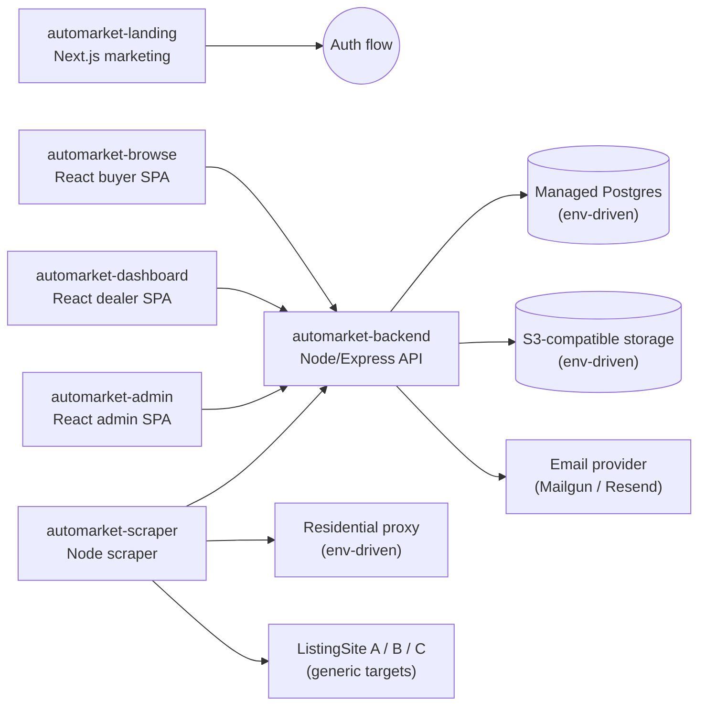

# AutoMarket Platform (Sanitized Portfolio Showcase)

> **SECURITY-SANITIZED:** This repository is a sanitized portfolio copy of a real, deployed B2B automotive trading platform. All customer brand names, infrastructure identifiers, credentials, and business data have been replaced with fictional **AutoMarket** placeholders. The original production credentials have been rotated and are not included here.

## Overview

A full-stack car dealership platform enabling B2B vehicle sourcing, listing management, dealer dashboards, admin tooling, automated scraping, and transactional email workflows.

## Architecture



## Sub-projects

| Directory | Stack | Purpose | README |
|-----------|-------|---------|--------|
| [`automarket-backend/`](automarket-backend/) | Node.js, Express, Sequelize, PostgreSQL | REST API: auth, listings, invoices, emails, cron jobs | [README](automarket-backend/README.md) |
| [`automarket-scraper/`](automarket-scraper/) | Node.js, Puppeteer/Cheerio, cron | Automated listing scraper with checker service | [README](automarket-scraper/README.md) |
| [`automarket-admin/`](automarket-admin/) | React, Vite, Tailwind | Internal admin panel for dealers, deals, scraping | [README](automarket-admin/README.md) |
| [`automarket-browse/`](automarket-browse/) | React, Vite, i18n (5 languages) | Public buyer-facing car browse experience | [README](automarket-browse/README.md) |
| [`automarket-dashboard/`](automarket-dashboard/) | React, TypeScript, Vite | Dealer dashboard: wishlist, purchases, invoices | [README](automarket-dashboard/README.md) |
| [`automarket-landing/`](automarket-landing/) | Next.js, Tailwind | Marketing site with auth flows | [README](automarket-landing/README.md) |

## Documentation

- [Feature inventory](FEATURES.md) — everything each app can do, by role
- [Database schema](DATABASE.md) — ER diagrams, table reference, FK matrix
- Canonical DDL: [`automarket-backend/src/sql/create_tables.sql`](automarket-backend/src/sql/create_tables.sql)

## Getting started

All six sub-projects live in this single repo. Each has its own `.env.example` and [README](automarket-backend/README.md) with setup details. Dependencies are **not** committed — run `npm install` in each project you want to run.

### Recommended startup order

**1. Backend (required first)**

```bash
cd automarket-backend
cp .env.example .env   # fill in DB credentials and JWT_SECRET
npm install
npm start              # http://localhost:3000
```

See [automarket-backend/README.md](automarket-backend/README.md) for database schema setup.

**2. Frontends (pick any or all)**

```bash
# Marketing / auth site
cd automarket-landing && cp .env.example .env && npm install && npm run dev

# Public car browse
cd automarket-browse && cp .env.example .env && npm install && npm run dev

# Dealer dashboard
cd automarket-dashboard && cp .env.example .env && npm install && npm run dev

# Internal admin panel
cd automarket-admin && cp .env.example .env && npm install && npm run dev
```

Point each frontend's API URL env var at `http://localhost:3000` (or `http://localhost:3000/api` where applicable).

**3. Scraper (optional, needs DB + API)**

```bash
cd automarket-scraper
cp .env.example .env
npm install
npm start
```

See [automarket-scraper/README.md](automarket-scraper/README.md) for scheduler and memory-optimization details.

## Key technical highlights

- Multi-tenant dealer management with role-based access
- Full listing lifecycle: scrape → publish → reserve → offer → purchase → invoice → delivery tracking
- S3-compatible object storage for images and PDF invoices
- Transactional email system with multi-language templates
- Scheduled cron jobs: newsletter, wishlist notifications, weekly reports, listing expiry
- Residential proxy integration for scraping with IP-block bypass
- Zoho CRM integration (optional, env-driven)
- Dockerized deployment with nginx reverse proxy configs

## Sanitization notes

The following were removed or replaced:

- All `.env` files with live credentials → `.env.example` placeholders
- Customer data dumps (xlsx, csv, json, invoices, dealer seed data)
- Real scraping target names → generic `ListingSiteA/B/C`
- Production customer domain → `*.automarket.example.com`
## License

Portfolio showcase only. Not licensed for commercial use of the original customer's product.
