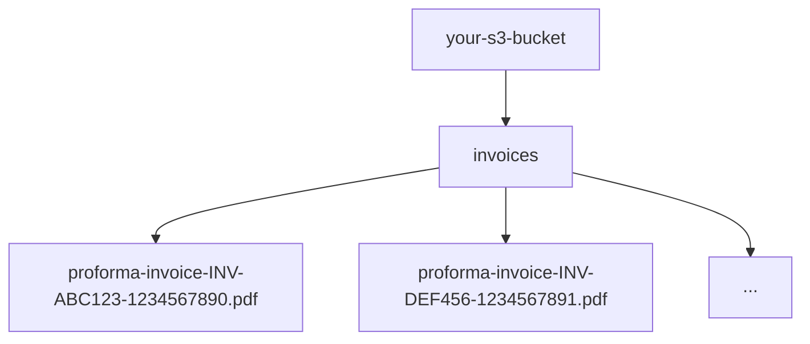

# SECURITY-SANITIZED: Production brand and infrastructure details were redacted for public showcase.

# PDF Proforma Invoice Generation System

## Overview

This system automatically generates professional PDF proforma invoices when a listing is marked as purchased. The PDFs are uploaded to AWS S3 and the links are stored in the database for easy access by dealers through their dashboard.

## System Components

### 1. PDF Service (`src/services/pdfService.js`)

**Main Functions:**

- `generateInvoiceHTML(invoiceData)` - Creates HTML template for the invoice
- `generateProformaInvoicePDF(invoiceData)` - Converts HTML to PDF using Puppeteer
- `createAndUploadInvoicePDF(invoiceData)` - Complete workflow: HTML → PDF → S3 upload

**Features:**

- Professional responsive HTML template
- Company branding and styling
- Vehicle information display
- Dealer/client information
- Invoice details (dates, amounts, payment status)
- Currency formatting
- Features and equipment listing

### 2. S3 Service Extension (`src/services/s3Service.js`)

**New Function:**

- `uploadPdfToS3(pdfBuffer, folder, filename)` - Uploads PDF files to S3

**Configuration:**

- Uses existing AWS S3 configuration
- Uploads to `invoices/` folder by default
- Sets proper `application/pdf` content type
- Generates unique filenames using UUID

### 3. Integration (`src/controllers/listingController.js`)

**Integration Point:** `setPurchased` function

**Workflow:**

1. Invoice is created in database
2. Dealer information is fetched
3. PDF generation is triggered with complete invoice data
4. PDF is uploaded to S3
5. Invoice record is updated with PDF link
6. Process continues with email notifications

**Error Handling:**

- PDF generation failures don't break invoice creation
- Errors are logged but don't affect the main transaction

## Data Flow

```
Listing Purchase Request
    ↓
Invoice Created in Database
    ↓
Gather Data (Invoice + Dealer + Listing + Company)
    ↓
Generate HTML Template
    ↓
Convert HTML to PDF (Puppeteer)
    ↓
Upload PDF to S3
    ↓
Update Invoice with PDF Link
    ↓
Continue with Email/Status Updates
```

## PDF Template Structure

### Header

- Company branding with gradient background
- "PROFORMA INVOICE" title
- Invoice number

### Company & Client Information

- Two-column layout
- Company details (from environment variables)
- Client/dealer details (from database)

### Vehicle Information

- Highlighted section with vehicle emoji
- Two-column grid with key vehicle details:
  - Brand & Model
  - Registration Number
  - VIN Number
  - Color, Fuel Type, Transmission
  - Mileage, First Registration
- Features section (if available)

### Invoice Details

- Invoice date, due date, payment status
- Three-column layout

### Amount Section

- Prominent display of total amount
- Currency-formatted display
- Large, highlighted styling

### Footer

- Professional footer with payment instructions
- Company contact information

## Configuration

### Environment Variables

Add these optional variables to customize company information in PDFs:

```bash
# Company information for PDF invoices (optional - defaults provided)
COMPANY_ADDRESS="Your Company Address, City, Country"
COMPANY_PHONE="+XX XXX XXX XXX"
COMPANY_EMAIL="info@yourcompany.com"
COMPANY_WEBSITE="www.yourcompany.com"
```

### Dependencies

The system uses these existing dependencies:

- `puppeteer-core` - HTML to PDF conversion
- `aws-sdk` - S3 file upload
- `uuid` - Unique filename generation

## Database Schema

### Invoice Model Updates

The `link` field in the `invoices` table now stores the S3 URL of the generated PDF:

```sql
ALTER TABLE invoices ADD COLUMN IF NOT EXISTS link TEXT;
```

This field is already present in the current schema.

## API Response

When an invoice is created, the API response includes the PDF link:

```json
{
  "message": "Listing marked as purchased successfully",
  "data": {
    "listing_id": 123,
    "amount_sold_for": 25000,
    "invoice": {
      "id": 456,
      "invoice_number": "INV-ABC123-1234567890",
      "amount": 25000,
      "currency": "EUR",
      "due_date": "2024-01-15",
      "is_paid": false,
      "pdf_link": "https://your-bucket.s3.amazonaws.com/invoices/proforma-invoice-INV-ABC123-1234567890.pdf"
    }
  }
}
```

## Dashboard Integration

### Dealer Dashboard (`src/controllers/userDashboardController.js`)

The `getInvoices` endpoint now includes the `link` field in the response, allowing dealers to:

- View their invoices
- Download PDF proforma invoices directly
- Access invoice details and payment status

## Testing

### Test Files

1. **`src/tests/pdfService.test.js`** - Comprehensive PDF generation testing
2. **`test_pdf_generation.bat`** - Windows batch script for easy testing
3. **`test_pdf_generation.sh`** - Linux/Mac bash script for testing

### Running Tests

**Windows:**

```cmd
test_pdf_generation.bat
```

**Linux/Mac:**

```bash
./test_pdf_generation.sh
```

**Manual Node.js:**

```bash
node src/tests/pdfService.test.js
```

### Test Features

- Generates sample PDF with test data
- Saves PDF locally for visual inspection
- Uploads to S3 and returns URL
- Validates all components work together
- Comprehensive error reporting

## Error Handling

### PDF Generation Failures

- Logged but don't break invoice creation
- Invoice is still created successfully
- Email notifications still work
- Manual PDF generation can be triggered later

### Common Issues & Solutions

1. **Puppeteer Issues**

   - Ensure chromium-browser is installed
   - Check executablePath in pdfService.js
   - Verify system dependencies

2. **S3 Upload Issues**

   - Verify AWS credentials
   - Check S3 bucket permissions
   - Ensure bucket policy allows uploads

3. **Template Issues**
   - Check HTML syntax in generateInvoiceHTML
   - Verify all data fields are available
   - Test with sample data

## File Storage Structure

PDFs are stored in S3 with this structure:



## Security Considerations

### S3 Access

- PDFs are publicly readable (required for dealer access)
- Invoice numbers are not predictable (UUID-based)
- Access can be controlled via bucket policies

### Data Privacy

- No sensitive payment information in PDFs
- Only necessary business information included
- Company information configurable via environment

## Future Enhancements

### Potential Improvements

1. **Multiple Templates** - Different PDF styles for different regions/languages
2. **Digital Signatures** - Add company signature to PDFs
3. **Watermarks** - Add "PROFORMA" watermarks for clarity
4. **Multi-language** - Generate PDFs in dealer's preferred language
5. **Email Attachments** - Attach PDFs directly to email notifications
6. **Invoice History** - Track PDF regeneration and versions

### Integration Opportunities

1. **Payment Gateway** - Link PDFs to payment processors
2. **Document Management** - Integrate with document management systems
3. **Accounting Systems** - Export PDF data to accounting software
4. **Mobile App** - Direct PDF access from mobile applications

## Monitoring & Maintenance

### Logs to Monitor

- PDF generation success/failure rates
- S3 upload performance
- Puppeteer browser launch issues
- Template rendering errors

### Regular Maintenance

- Update Puppeteer version for security
- Monitor S3 storage costs
- Review PDF template for brand updates
- Test with different browsers/devices

## Troubleshooting Guide

### PDF Generation Fails

1. Check Puppeteer/Chromium installation
2. Verify HTML template syntax
3. Check system memory availability
4. Review console error logs

### S3 Upload Fails

1. Verify AWS credentials in .env
2. Check S3 bucket permissions
3. Verify bucket exists and is accessible
4. Check network connectivity

### Missing Data in PDF

1. Verify invoice data is complete
2. Check dealer information exists
3. Confirm listing details are available
4. Review company environment variables

## Support & Contact

For issues with the PDF generation system:

1. Check the troubleshooting guide above
2. Review error logs in the console
3. Test with the provided test scripts
4. Verify all dependencies are installed correctly
