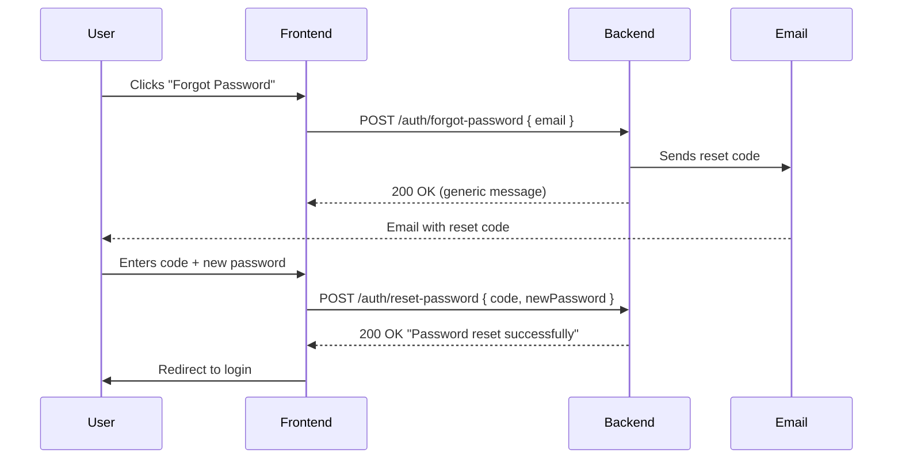

# SECURITY-SANITIZED: Production brand and infrastructure details were redacted for public showcase.

# Password Reset API – Frontend Integration Guide

## Overview

The backend exposes **two endpoints** for a code-based password reset flow. No authentication token is required for either endpoint.



---

## Endpoint 1 – Request a Reset Code

```
POST /auth/forgot-password
Content-Type: application/json
```

### Request Body

| Field   | Type   | Required | Description              |
|---------|--------|----------|--------------------------|
| `email` | string | ✅       | The user's email address |

### Example Request

```json
{
  "email": "dealer@example.com"
}
```

### Responses

| Status | Body | When |
|--------|------|------|
| **200** | `{ "message": "If an account with this email exists, a password reset code has been sent." }` | Always (whether the email exists or not – by design, to prevent email enumeration) |
| **400** | `{ "error": "Email is required", "statusCode": 400 }` | Missing `email` field |
| **400** | `{ "error": "Invalid email format", "statusCode": 400 }` | Malformed email |
| **500** | `{ "error": "Internal server error", "statusCode": 500 }` | Unexpected server error |

> [!IMPORTANT]
> The 200 response is **always the same message** regardless of whether the email exists. The frontend should display this message as-is and proceed to the "enter code" screen.

### What Happens on the Backend

1. Validates the email format.
2. Looks up the user by email.
3. Generates a random alphanumeric reset code.
4. Stores it in the `reset_password_codes` table (`is_used = false`).
5. Sends the code via email (localized to the user's `language` field: `en`, `nl`, `fr`, `it`, `de`).

---

## Endpoint 2 – Reset the Password

```
POST /auth/reset-password
Content-Type: application/json
```

### Request Body

| Field         | Type   | Required | Constraints         | Description                          |
|---------------|--------|----------|---------------------|--------------------------------------|
| `code`        | string | ✅       | Must be unused       | The reset code received via email    |
| `newPassword` | string | ✅       | Min 6 characters     | The user's desired new password      |

### Example Request

```json
{
  "code": "k8f2ja9xm1bq7np3",
  "newPassword": "MyNewSecurePass123"
}
```

### Responses

| Status | Body | When |
|--------|------|------|
| **200** | `{ "message": "Password reset successfully" }` | Code valid, password updated |
| **400** | `{ "error": "Reset code and new password are required", "statusCode": 400 }` | Missing `code` or `newPassword` |
| **400** | `{ "error": "Password must be at least 6 characters long", "statusCode": 400 }` | `newPassword` too short |
| **400** | `{ "error": "Invalid or expired reset code", "statusCode": 400 }` | Code not found or already used |
| **400** | `{ "error": "Reset code has expired", "statusCode": 400 }` | Code older than **24 hours** |
| **500** | `{ "error": "Internal server error", "statusCode": 500 }` | Unexpected server error |

### What Happens on the Backend

1. Finds the reset code record where `is_used = false`.
2. Checks the code is not older than **24 hours** (based on `created_at`).
3. Hashes the new password with bcrypt (salt rounds = 10).
4. Updates the user's password.
5. Marks the reset code as `is_used = true` (cannot be reused).

---

## Suggested Frontend Flow

### Page 1 – "Forgot Password" Form

- Single input: **Email**
- On submit → call `POST /auth/forgot-password`
- On success → show a confirmation message and navigate to the code entry page

### Page 2 – "Enter Reset Code & New Password" Form

- Inputs: **Reset Code**, **New Password**, **Confirm Password** (confirm is frontend-only)
- Frontend validation:
  - Password ≥ 6 characters
  - Password and confirm password match
- On submit → call `POST /auth/reset-password`
- On success → show success toast / message and redirect to login

### Error Handling

- Display `error` field from response body for 400 errors
- Show a generic "Something went wrong" for 500 errors
- After a successful reset, clear any stored auth state

> [!TIP]
> The reset code is a plain alphanumeric string (not a URL/link). The user needs to manually copy-paste or type it from their email into the frontend form.
